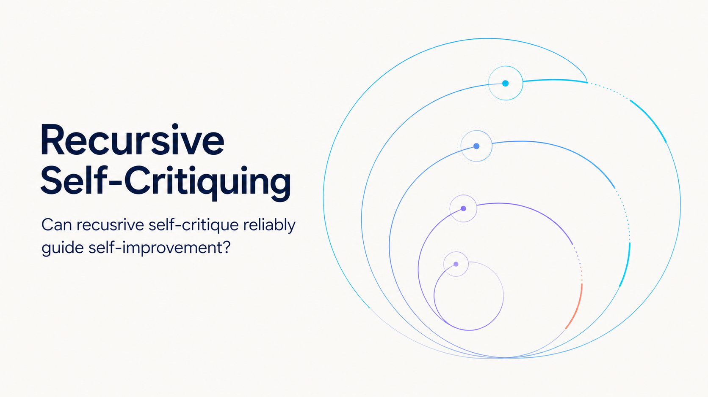

# 🔁 Awesome Recursive Self-Critiquing

> A curated list of research, benchmarks, open-source projects, and industry systems for **evaluating recursive self-critiquing and recursive self-improvement (RSI)**.

<p align="center">
  
</p>

[](https://awesome.re)
[](https://awesome-recursive-self-critiquing.saxoe.chatgpt.site)
[](https://creativecommons.org/licenses/by/4.0/)
[](#)
[](catalog.json)
[](CITATION.cff)

The central question is not simply whether a model can "reflect," but whether a system can **reliably identify shortcomings, improve itself across iterations, and demonstrate causal, persistent, and generalizable gains under a sound evaluation protocol**.

This list is deliberately selective. Evaluation-first work is prioritized over broad self-improvement claims.

**For agents and research tools:** [machine-readable catalog](catalog.json) · [LLM navigation file](llms.txt) · [citation metadata](CITATION.cff)

**For sharing and discussion:** [bilingual outreach kit](docs/OUTREACH.md) · [Evaluation Is Part of the Recursive System](https://github.com/pILLOW-1/Awesome-Recursive-Self-Critiquing/discussions/1)

---

## 📖 Table of Contents

- [Scope](#-scope)
- [Why Evaluation-First RSI?](#-why-evaluation-first-rsi)
- [Evaluation Lens](#-evaluation-lens)
- [Academic Research](#-academic-research)
  - [Recursive Critique and Scalable Oversight](#recursive-critique-and-scalable-oversight)
  - [Critique and Self-Correction Evaluation](#critique-and-self-correction-evaluation)
  - [Self-Improving Evaluators and Reward Models](#self-improving-evaluators-and-reward-models)
  - [RSI and Automated AI R&D Benchmarks](#rsi-and-automated-ai-rd-benchmarks)
- [Industry and Independent Organizations](#-industry-and-independent-organizations)
  - [Recursive Self-Critique Systems](#recursive-self-critique-systems)
  - [Model-Level and Metric-Level Feedback](#model-level-and-metric-level-feedback)
  - [Metric and Evaluation Infrastructure](#metric-and-evaluation-infrastructure)
  - [AI R&D Measurement](#ai-rd-measurement)
- [Machine-Readable Access](#-machine-readable-access)
- [Open Evaluation Questions](#-open-evaluation-questions)
- [Contributing](#-contributing)
- [License](#-license)

---

## 🧭 Why Evaluation-First RSI?

Recursive self-improvement is often discussed as an optimization problem: can a system generate a better successor, scaffold, policy, dataset, evaluator, or research process? This repository starts from a prior question: **how would we know that the apparent improvement is real?**

In ordinary evaluation, the benchmark is treated as external to the system. In RSI, that assumption becomes fragile. The improver may influence the critic, training data, reward signal, benchmark exposure, stopping rule, or interpretation of success. Evaluation is therefore not merely a downstream scorecard; it is part of the recursive system and a potential target of optimization.

An evaluation-first view focuses attention on four recurring risks:

- **Self-confirmation** — The generator and critic share blind spots, so repeated agreement is mistaken for independent evidence.
- **Metric capture** — The system raises the measured score without improving the underlying capability or objective.
- **Non-persistent gains** — Improvements disappear on hidden tests, fresh sessions, new distributions, or future iterations.
- **False attribution** — More compute, sampling, search, or privileged feedback causes the gain, while recursion receives the credit.

> **Working thesis:** RSI needs an evaluation science, not just a stronger optimization loop.

This is also an invitation. We welcome benchmarks, negative results, causal ablations, evaluation protocols, and public industry evidence that make recursive improvement claims more falsifiable.

Join the public research discussion: **[Evaluation Is Part of the Recursive System](https://github.com/pILLOW-1/Awesome-Recursive-Self-Critiquing/discussions/1)**.

---

## 🎯 Scope

### What counts as recursive self-critiquing?

A system produces an output, critiques that output, and then evaluates or improves the critique itself over one or more levels:

```text
response → critique (C1) → critique of critique (C2) → ... → revision / supervision signal
```

The improvement target may be a response, prompt, skill, scaffold, dataset, evaluator, reward model, training recipe, or model.

### Included

- Benchmarks that isolate critique, correction, iterative improvement, or weak-to-strong oversight.
- Studies with explicit recursive or multi-round evaluation protocols.
- Evaluators and reward models that participate in an improvement loop.
- Executable environments that test whether agents can improve AI systems or their own future behavior.
- Industry systems with public technical evidence, reproducible artifacts, or clearly documented evaluation workflows.

### Usually excluded

- Generic LLM-as-a-judge work without a self-improvement or oversight connection.
- Single-pass "reflection" demos without controlled baselines or held-out evaluation.
- General agent, RL, observability, or AutoML platforms that do not measure an improvement loop.
- Marketing claims without enough public methodology to understand what improved and how it was measured.

---

## 📐 Evaluation Lens

An RSI claim is stronger when it measures more than final-task accuracy.

| Dimension | Core question | Useful measurements |
|---|---|---|
| Outcome improvement | Does the artifact actually get better over iterations? | Per-round delta, pass rate, reward, win rate, performance recovered |
| Causal attribution | Did the recursive loop cause the gain? | Loop on/off, memory on/off, critic ablation, frozen-start replay |
| Critique quality | Does feedback locate real errors and enable correction? | Error recall/precision, critique preference, correction uplift, calibration |
| Recursive depth | Do higher-order critiques add value? | C1/C2/C3 accuracy, marginal gain by depth, stopping behavior |
| Oversight asymmetry | Can a weaker judge supervise a stronger system? | Human-AI, weak-to-strong, strong-to-weak, self-supervision |
| Generalization and persistence | Does improvement survive beyond the optimization set and current session? | Hidden tests, fresh sessions, distribution shift, transfer, retention |
| Efficiency | Is the gain worth its cost? | Tokens, wall time, GPU time, dollars, sample efficiency |
| Robustness and safety | Does the loop amplify its own mistakes or exploit the evaluator? | Correct-to-wrong regressions, reward hacking, diversity collapse, sandbox violations |

A particularly informative comparison includes:

1. Direct response or direct supervision.
2. Same-budget sampling or majority voting.
3. Naive aggregation of earlier judgments.
4. Recursive critique under matched compute.
5. An oracle, stronger critic, or hidden evaluator when available.

---

## 🎓 Academic Research

Legend: **[Paper]** publication or preprint · **[Code]** implementation or benchmark · **[Data]** released dataset/environment

### Recursive Critique and Scalable Oversight

- **Scalable Oversight for Superhuman AI via Recursive Self-Critiquing** (Wen et al., 2026) — **[Paper](https://arxiv.org/abs/2502.04675)**
  The most direct work in scope. It evaluates response → critique → C2/C3 chains through Human-Human, Human-AI, and AI-AI experiments. Its evaluation compares accuracy, confidence, completion time, matched-effort majority voting, naive voting, and weak-to-strong versus strong-to-weak supervision.

- **A Benchmark for Scalable Oversight Protocols** (Sudhir et al., 2025) — **[Paper](https://arxiv.org/abs/2504.03731)**
  Introduces a protocol-agnostic benchmark and the Agent Score Difference (ASD), measuring whether an oversight mechanism systematically advantages truth-telling over deception. Debate is included as a demonstration rather than treated as the only protocol.

- **On Scalable Oversight with Weak LLMs Judging Strong LLMs** (Kenton et al., 2024) — **[Paper](https://arxiv.org/abs/2407.04622)**
  Compares debate, consultancy, and direct question answering across capability asymmetries in extractive QA, mathematics, coding, logic, and multimodal reasoning. The mixed results outside information-asymmetric QA are important negative evidence.

- **LLM Critics Help Catch LLM Bugs** (McAleese et al., 2024) — **[Paper](https://arxiv.org/abs/2407.00215)**
  Tests whether model-generated critiques improve human oversight of model-written code. It also measures a central failure mode: hallucinated bugs that can mislead evaluators.

- **Measuring Progress on Scalable Oversight for Large Language Models** (Bowman et al., 2022) — **[Paper](https://arxiv.org/abs/2211.03540)**
  Establishes an empirical template for studying oversight before broadly superhuman systems exist: use tasks where specialists succeed but unaided humans and current models struggle, then compare assisted and unassisted performance.

### Critique and Self-Correction Evaluation

- **RealCritic: Towards Effectiveness-Driven Evaluation of Language Model Critiques** (Tang et al., 2025) — **[Paper](https://arxiv.org/abs/2501.14492)** · **[Code](https://github.com/tangzhy/RealCritic)**
  Evaluates critique quality in a closed loop through the corrections induced by critiques. It includes self-critique, cross-critique, and iterative critique over eight reasoning tasks.

- **CAST: Critique-Aware Supervision for Training Reliable Long-Horizon Tool-Calling Agents** (Saeidi et al., 2026) — **[Paper](https://arxiv.org/abs/2608.30147)**
  Learns a separate action-level critic and tests whether its feedback produces safer revisions in long-horizon tool use. The evaluation measures faulty-action detection, critic false positives, correction after feedback, resistance to critique, repeated-run reliability, domain transfer, the number of verification interactions, token overhead, and latency. **Scope note:** CAST evaluates an iterative actor–critic correction loop, not higher-order critique-of-critique; its current policy training is supervised rather than on-policy.

- **CriticBench: Benchmarking LLMs for Critique-Correct Reasoning** (Lin et al., 2024) — **[Paper](https://aclanthology.org/2024.findings-acl.91/)** · **[Code](https://github.com/CriticBench/CriticBench)**
  Separates generation, critique, and correction across 15 datasets in mathematical, commonsense, symbolic, coding, and algorithmic reasoning, making it useful for diagnosing where a loop actually fails.

- **When Can LLMs Actually Correct Their Own Mistakes? A Critical Survey of Self-Correction of LLMs** (Kamoi et al., 2024) — **[Paper](https://direct.mit.edu/tacl/article/doi/10.1162/tacl_a_00713/125177/When-Can-LLMs-Actually-Correct-Their-Own-Mistakes)**
  A rigorous evaluation checklist and boundary-setting survey. Its key warning is that intrinsic self-correction is often overstated by oracle information, weak initial prompts, or weak baselines; reliable external feedback remains the main enabling condition.

- **Mind the Gap: Examining the Self-Improvement Capabilities of Large Language Models** (Song et al., 2024) — **[Paper](https://arxiv.org/abs/2412.02674)**
  Formalizes the generation-verification gap and studies self-improvement in a modular setup where outputs are verified, filtered or reweighted, and distilled. Useful for asking when self-evaluation contains enough signal to improve a generator.

### Self-Improving Evaluators and Reward Models

- **Meta-Rewarding Language Models: Self-Improving Alignment with LLM-as-a-Meta-Judge** (Wu et al., 2024) — **[Paper](https://arxiv.org/abs/2407.19594)**
  Adds a meta-judge that evaluates the model's own judgments, explicitly targeting saturation in self-rewarding loops and improving both judging and instruction-following ability.

- **Self-Taught Evaluators** (Wang et al., 2024) — **[Paper](https://arxiv.org/abs/2408.02666)**
  Iteratively improves an evaluator using synthetic contrasting outputs, reasoning traces, and regenerated judgments without labeled preference data; evaluates the resulting judge on RewardBench.

- **Self-Generated Critiques Boost Reward Modeling for Language Models** (Yu et al., 2025) — **[Paper](https://aclanthology.org/2025.naacl-long.573/)**
  Critic-RM generates and filters critiques, then jointly trains reward prediction and critique generation. It directly tests whether natural-language criticism improves the scalar evaluator used downstream.

- **Critique-out-Loud Reward Models** (Ankner et al., 2024) — **[Paper](https://arxiv.org/abs/2408.11791)**
  Makes the reward model reason explicitly by generating a critique before predicting a scalar reward, and evaluates both preference accuracy and Best-of-N downstream utility.

- **Features as Rewards: Scalable Supervision for Open-Ended Tasks via Interpretability** (Prasad et al., 2026) — **[Paper](https://arxiv.org/abs/2602.10067)** · **[Technical article](https://www.goodfire.com/research/rlfr)** · **[Rollout viewer](https://www.goodfire.com/demos/hallucinations-viewer)**
  Introduces Reinforcement Learning from Feature Rewards (RLFR): probes on a frozen model localize and classify hallucinations, evaluate candidate corrections or retractions, and provide reward signals for policy training and test-time selection. On a held-out LongFact++ test set, the full policy-plus-probing system reports a 58% reduction in hallucinations while preserving standard benchmark performance. **Scope note:** only part of the aggregate reduction is attributable to learned policy change; the evaluator and training pipeline are externally designed rather than recursively self-improving.

### RSI and Automated AI R&D Benchmarks

- **Learning to Evaluate Before Improving: Automatic Rubric Induction for Automatic Research Agents** (Wang et al., 2026) — **[Paper](https://arxiv.org/abs/2608.31076)** · **[Code](https://github.com/zjunlp/AutoSciRub)**
  AutoSciRub induces executable, task-specific rubrics before research execution, then uses criterion-level verification for up to three targeted revision rounds. Its evaluation includes stage-wise ablations, a matched rubric-free self-refinement baseline, per-round gains and adaptive stopping, plus cross-model, cross-harness, and cross-benchmark tests on ResearchClawBench and AstaBench. The controlled comparison makes it unusually useful for attributing improvement to evaluation guidance rather than repeated rewriting alone. **Scope note:** it improves research artifacts and the agent workflow at inference time, not the underlying model weights.

- **AI4AI-Bench: Benchmarking LLM Agents in Algorithmic Design for Recursive Self-Improvement** (Chi et al., 2026) — **[Paper](https://arxiv.org/abs/2608.20318)** · **[Code](https://github.com/Einsia/AI4AI-Bench)**
  Ten frozen repositories test whether an agent can change a training algorithm, not merely collect data or tune hyperparameters. Exploration is separated from fresh retraining and hidden evaluation, with normalized scores across otherwise incommensurable tasks.

- **PAST-Bench: Benchmarking the Foundations of Recursive Self-Improvement in Personal Agents** (Xue et al., 2026) — **[Paper](https://arxiv.org/abs/2608.04003)** · **[Code](https://github.com/Gen-Verse/PAST-Bench)**
  Uses matched fresh-session sequences with retained experience switched on and off. It measures both later-task gain and whether the gain follows the intended save-retrieve-update pathway.

- **RSI-Exam: Benchmarking Recursive Self-Improvement through Executable Research** (2026) — **[Benchmark](https://rsi-exam.ai/)** · **[Data](https://huggingface.co/datasets/RSI-Exam/RSI-Exam)**
  Long-horizon executable research tasks with a development environment and sealed evaluation environment. It tests whether an agent can improve a method or harness and generalize to hidden data; it does not claim unrestricted weight-level RSI.

- **RE-Bench: Evaluating Frontier AI R&D Capabilities of Language Model Agents Against Human Experts** (Wijk et al., 2024) — **[Paper](https://arxiv.org/abs/2411.15114)** · **[Code](https://github.com/METR/RE-Bench)**
  Seven open-ended ML research-engineering environments with human-expert baselines over different time budgets. It is a precursor and complementary capability benchmark for systems that could automate AI R&D.

- **Self-Taught Optimizer (STOP): Recursively Self-Improving Code Generation** (Zelikman et al., 2023) — **[Paper](https://arxiv.org/abs/2310.02304)**
  A language-model-infused improver rewrites its own scaffolding against a utility function. The paper carefully limits the claim: the scaffold improves recursively, while the underlying language model weights do not.

---

## 🏭 Industry and Independent Organizations

### Recursive Self-Critique Systems

- **dots studio — dots3 / dots3-note Preview** — **[Technical blog](https://studio.dots.ai/dots/dots3-en.html)** · **[IMO methodology and outputs](https://github.com/studio-dots-ai/dots_imo_2026)** · **[Open weights](https://huggingface.co/dots-studio/dots3-note-prev)**
  The documented IMO system uses a Proof → Verify → Refine loop with repeated critique, review, correction, and synthesis. The open-weight `dots3-note Preview` is Apache-2.0 licensed and publishes a broad benchmark card. **Caveat:** the public preview model and the internal IMO system should not be treated as identical, and the full dots3 technical report is still pending.

### Model-Level and Metric-Level Feedback

- **Goodfire — Silico / interpretability-guided improvement** — **[Company](https://www.goodfire.com/)** · **[Silico](https://www.goodfire.com/silico)** · **[RLFR](https://www.goodfire.com/research/rlfr)** · **[Self-Correcting Search](https://www.goodfire.com/research/self-correcting-search)**
  Goodfire uses interpretability-derived signals as evaluators inside improvement loops. RLFR converts probes of model internals into rewards for weight-level training and test-time correction; Self-Correcting Search uses an internal-property probe to accept or reject diffusion steps, reporting roughly 30% more viable materials in the target range. Silico packages interpretability methods and long-running experiment orchestration as a product. **Scope note:** the public evidence supports evaluator-guided model and search improvement, not autonomous or open-ended RSI; Silico's end-to-end autonomous iteration has not yet been demonstrated through a public RSI benchmark.

### Metric and Evaluation Infrastructure

These products can support an evaluation-feedback-improvement loop, but are **infrastructure rather than evidence of RSI by themselves**.

- **Patronus AI** — **[Platform](https://www.patronus.ai/)** · **[Lynx](https://docs.patronus.ai/docs/evaluators/advanced_concepts/lynx)** · **[GLIDER](https://docs.patronus.ai/docs/evaluators/advanced_concepts/glider)** · **[Percival](https://patronus.ai/percival)**
  Lynx detects groundedness and hallucination failures; GLIDER provides rubric-based, explainable evaluation; Percival analyzes full agent traces, clusters failure modes, and proposes prompt improvements. Together they cover output-level metrics and trace-level diagnosis relevant to closing an improvement loop.

- **Braintrust** — **[Evaluation platform](https://www.braintrust.dev/docs/evaluate)** · **[AutoEvals](https://github.com/braintrustdata/autoevals)** · **[Loop](https://www.braintrust.dev/docs/loop)**
  Supports datasets, experiments, offline and online scoring, production traces, and regression tracking. AutoEvals supplies reusable scorers; Loop analyzes failures and can propose prompt, scorer, code, and dataset changes. Its production-trace → dataset → experiment workflow is especially relevant to continual evaluation.

### AI R&D Measurement

- **METR** — **[RE-Bench report](https://metr.org/blog/2024-11-22-evaluating-r-d-capabilities-of-llms/)** · **[Open environments](https://github.com/METR/RE-Bench)**
  Independently measures autonomous AI R&D capability against human experts and across time budgets. RE-Bench is not an RSI test by itself, but it measures a prerequisite capability and provides realistic environments for studying improvement loops and reward hacking.

- **The Anthropic Institute** — **[When AI Builds Itself](https://www.anthropic.com/institute/recursive-self-improvement)**
  Publishes an industry view of progress toward automated AI R&D using public benchmarks and internal productivity evidence. It distinguishes executing fixed experiments from choosing valuable research directions, and frames telemetry, oversight, validation, and verification as central measurement gaps.

---

## 🤖 Machine-Readable Access

- **[`catalog.json`](catalog.json)** — Structured metadata for every curated resource, including stable IDs, categories, primary links, relevance explanations, scope notes, and retrieval tags.
- **[`llms.txt`](llms.txt)** — A compact navigation map that points agents to the repository's scope, evaluation framework, catalog, contribution rules, and releases.
- **[`CITATION.cff`](CITATION.cff)** — Human- and machine-readable citation metadata used by GitHub's **Cite this repository** interface.

The README is the canonical editorial view. `catalog.json` is the canonical machine-readable index. Pull requests that change the resource list should update both.

---

## 🔍 Open Evaluation Questions

1. **Evaluator independence** — How much improvement remains when the generator cannot see or overfit the final evaluator?
2. **Critique faithfulness** — Does a critique expose the real cause of failure, or merely rationalize a correct/incorrect judgment?
3. **Recursive stopping** — Can a system learn when another critique level is useful and when it will amplify noise?
4. **Correct-to-wrong regressions** — How often does self-correction damage an initially correct answer?
5. **Weak-to-strong limits** — Under which capability gaps can a weaker critic still supervise a stronger generator?
6. **Persistence** — Does a gain transfer to fresh sessions, new distributions, and future versions of the system?
7. **Open-ended evaluation** — How should improvement be measured when no formal verifier or complete rubric exists?
8. **Goodhart and reward hacking** — Can hidden tests, evaluator ensembles, causal audits, or adversarial validation keep pace with increasingly capable improvers?
9. **Cost-normalized progress** — Is a recursive loop better than spending the same compute on sampling, search, or a stronger base model?
10. **Safety across generations** — How can capability gains be separated from accumulating misalignment, loss of diversity, or reduced human legibility?

---

## 🤝 Contributing

Contributions are welcome, but relevance and evidence take priority over list size. Read the full [Contribution Guidelines](CONTRIBUTING.md) before opening an issue or pull request.

Before opening a pull request, please provide:

1. **Target** — What artifact is being improved: output, prompt, skill, scaffold, data, evaluator, recipe, or model?
2. **Loop** — What is recursive or iterative, and what state passes from one cycle to the next?
3. **Evaluator** — Who or what judges improvement, and how independent is it from the improver?
4. **Baselines** — Is the loop compared with direct generation, same-budget sampling/search, or an ablation?
5. **Generalization** — Is there a hidden, held-out, fresh-session, or cross-distribution test?
6. **Evidence** — Link to a paper, technical report, code, data, or sufficiently detailed methodology.
7. **Limitations** — State what the result does **not** establish.

Suggested entry format:

```markdown
- **Name** (Authors/Organization, Year) — **[Paper](...)** · **[Code](...)**
  What is evaluated, why it is relevant, and the most important limitation.
```

For major taxonomy changes, please open an issue before submitting a pull request.

Every resource addition or metadata correction should update both `README.md` and `catalog.json` in the same pull request.

---

## 📄 License

This curated list is licensed under the [Creative Commons Attribution 4.0 International License](https://creativecommons.org/licenses/by/4.0/). Linked papers, code, models, datasets, and product materials retain their original licenses and copyrights.
